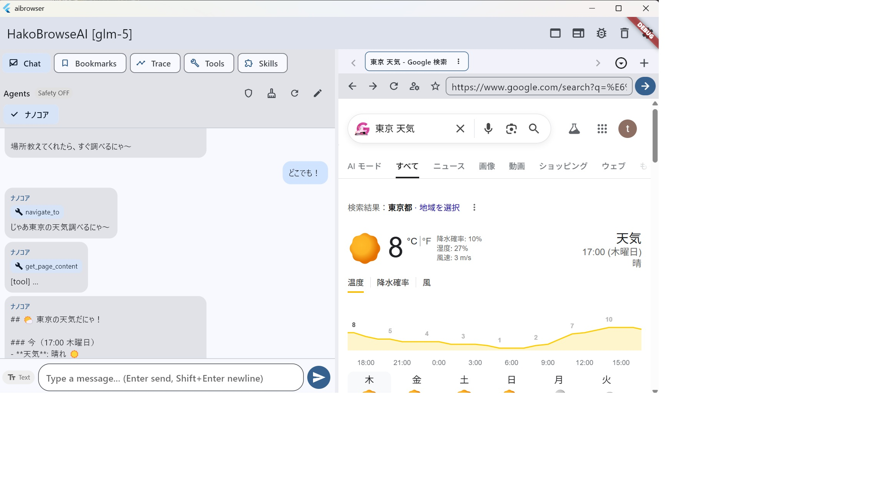

# HakoBrowseAI

AIチャット付きデスクトップブラウザです。  
左にチャット、右にブラウザを表示し、AIがツール経由でページを読んだり操作できます。



## 現在の仕様（要点）
- Windows/macOS向け Flutter アプリ
- プロバイダー: Anthropic系 / OpenAI系（API Key）
- ストリーミング応答
- Function Calling でブラウザ連携
- タブブラウズ（新規/複製/閉じる/他を閉じる、あふれ時スクロール/一覧切替）
- ブックマーク管理（一覧・検索・フォルダ・ピン）
- ブックマーク中クリックで新規タブを開いて即切替
- エージェントプロファイル（`SOUL.md` / `USER.md`）読込と画面編集
- コンテキスト圧縮（`/compress`）と会話クリア（`/clear`）
- `/` 入力時のコマンド補完ヒント（`/compress`, `/clear`, `/reload_agent`, `/reload_skill`）
- AI応答中の停止ボタン（送信ボタン再押下でキャンセル）
- チャット表示だけクリア（コンテキスト保持）ボタン
- チャット履歴上限（設定可能、超過時は古い履歴を自動削除）
- Chatタブ復帰時は最下部スクロール位置を維持
- ページ/ツール出力のサニタイズとシステムガードで注入耐性を強化
- Tool Trace ビューア（ツール実行ログ可視化）
- Safety Gate（危険な遷移/スクリプト実行の確認）
- セッション保存/復元（再起動後に会話を復元）
- セッション保存は「イベント駆動 + 60秒フォールバック + ライフサイクル強制保存」
- 保存ログに reason を表示（例: `Session saved (reason: ai_response)`）
- Tool API Profiles（設定画面で外部APIキーを登録）
- Popup policy 切替（`allow` / `sameWindow` / `deny`）
- Googleアカウント系ポップアップ向けの実用フォールバック（AccountChooser同一タブ遷移）
- 起動時は分割表示（チャット+ブラウザ）。表示モードはセッション保存

## セットアップ
```bash
flutter pub get
flutter run -d windows
```

## デフォルト状態プレビュー（デバッグ）
保存済みの設定/セッションを読まず、初期状態に近い画面で起動できます。

```bash
flutter run -d windows --dart-entrypoint-args=--default-state
```

- AppBarに `[DEFAULT]` が表示されます
- 設定/セッションの永続保存は行いません（runtime only）
- デフォルトスキル（`Weather Check`はON、`Moltbook Post`はOFF）を表示します
- API未設定でもブラウザ/UI操作は可能で、後からSettingsで登録できます

## GitHub公開チェック（推奨）
- `private/` と `AGENTS.md` が未追跡であることを確認
- APIキーやトークンがコミットに含まれていないことを確認
- `flutter analyze` が `No issues found` であることを確認
- `flutter build windows` が成功することを確認
- 公開ライセンス（例: MIT / Apache-2.0）を決めて `LICENSE` を追加

## 主要コマンド
- `/compress`: コンテキスト圧縮
- `/clear`: 会話履歴とコンテキストをクリア
- `/reload_agent`: `SOUL.md` / `USER.md` を再読み込み
- `/reload_skill`: `private/skills` を再読み込み（外部編集後に必須）

## エージェント設定ファイル
以下のいずれかで運用できます。

1. 単一エージェント
- `private/agent/SOUL.md`
- `private/agent/USER.md`

2. 複数エージェント定義
- `private/agents/<agent_name>/SOUL.md`
- `private/agents/<agent_name>/USER.md`

チャット画面上部のAgentチップで切り替え、編集ボタンから `SOUL/USER` を直接編集できます。

## Function Calling ツール
- `get_page_content`
- `navigate_to`
- `open_new_tab`
- `get_current_url`
- `execute_script`
- `load_skill_index`
- `load_skill`
- `load_skill_file`
- `http_request`
- `extract_structured`
- `add_bookmark`
- `list_bookmarks`
- `open_bookmark`

## スキル運用メモ
- スキル本文は常時プロンプト注入しません。必要時に `load_skill_index` / `load_skill` で段階読込します。
- 追加ファイルは `load_skill_file` で読み込みます（例: `RUNBOOK.md`, `FAILURES.md`, `EXAMPLES.md`）。
- スキルをファイル編集した後は、`/reload_skill` で再読込してください。
- `allowedTools` にないツールは呼べません（例: `http_request` を使うスキルには明示追加が必要）。
- 「機能がない」とAIが返した場合は、対象セクションを指定して再指示すると安定します。
- 例: `load_skill(skill_id="moltbook", section="2) 掲示板を見る（新着）") を読んでから実行して`

## 外部APIキー運用
- 設定画面の `Tool API Profiles` から `profile name + api key` を登録できます。
- `http_request` に `auth_profile` を指定すると、登録済みヘッダー（例: Authorization）が自動注入されます。
- `allowed hosts` を設定したプロファイルは、許可ホスト以外への送信をブロックします。
- `SKILL.md` やログへAPIキーを直接書かない運用を推奨します。

## Skill ファイル構成（推奨）
```text
private/skills/<skill_id>/
  SKILL.md        # 入口（目的・ツール・読む順）
  RUNBOOK.md      # 正常系の手順
  FAILURES.md     # 失敗時対応
  EXAMPLES.md     # 入力例
```
- 1スキル = 1フォルダです。
- 長文スキルは `SKILL.md` に全て書かず、補助ファイルへ分割する運用を推奨します。
- 現在はファイル編集中心です（GUI完結編集は今後の改善予定）。

## 権限モデル
- AIが直接OS操作することはできません
- AIが可能なのは「実装されたツール呼び出し」のみです
- `execute_script` は強い権限のため、必要に応じてドメイン制限や確認ダイアログの追加を推奨

## 永続化されるもの
- 保存される: 設定、ブックマーク、`SOUL.md` / `USER.md`、チャット履歴、Tool Trace、エージェントコンテキスト、Popup policy、表示モード
- 保存タイミング: 主要イベント時（送信/応答完了/設定変更/タブ操作）+ 60秒ごとのdirty保存 + 非アクティブ化時
- `/clear`: メモリ上の会話だけでなく永続セッションも削除
- 「チャット表示だけクリア」ボタン: 画面上の会話を消すのみ（エージェントコンテキストは保持）

## 参照ドキュメント
- 開発履歴: `DEVELOPMENT.md`
- 非公開メモ: `private/` 配下

## License
Apache License 2.0 (`LICENSE`)
